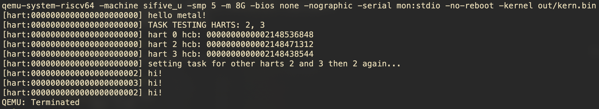

# UUNIX
tiny self-contained riscv64 machine mode kernel



## Build
```bash
make clean # needed for creating some dirs the first time
make
```

## Run
```bash
make qemu
```

## Build-Run
```bash
make qc
```

## Debug builds
Just add the needed debug flags to `FCR` for C compiler and `FLDR` for linker.

For example,
```bash
make cq FCR="-gdwarf-5"
```
# Priorities
This project is mainly supposed to serve as educational material for OS development.

## Discoverability
The reader should be grep through the source and read the cource of all identifiers (other than those defined in includes mentioned in clause 4 part 6 of `var/C17_final_proposal_official.pdf`).

## TBD

# Notes
This section is to serve as record keeping for architectural decisions. (not necessarily in order)

## C17 (ISO/IEC 9899:2018)
We choose C17 (see `var/C17_final_proposal_official.pdf`) for this project because it is decently old (as of date), stable, and tested with no new language features over C11 and numerous defect fixes over C11. C11-C17 supports for decent multiprocessing primitives useful for SMP. C23 is too new for my taste and introduces newer language features and keywords.

Note, as of date, C23 is the latest std.

Check for C17 is hardcoded in `src/pre.h` to mitigate a decent amount of behavioural ambiguity.

## `src/pre.h`
This file serves as the contract between the source code and the compiler.

As per C17 clause 4 part 6, it assumes `<float.h>,
<iso646.h>, <limits.h>, <stdalign.h>, <stdarg.h>, <stdbool.h>, <stddef.h>, <stdint.h>, <stdnoreturn.h>` (see `var/C17_final_proposal_official.pdf`).
